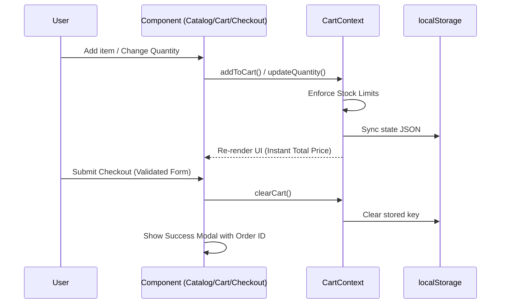

# Design: E-commerce Bootstrap

## Technical Approach
Implement a modular client-side e-commerce interface in React 19 and Vite 8.
Global cart state will be managed via `CartContext` using React Context. This context is the single source of truth for items in the cart, current quantities, and available stock validation. It synchronizes with `localStorage` on change and restores state on load.

## Architecture Decisions

| Option | Tradeoff | Decision |
|---|---|---|
| **State Management**: React Context vs Redux Toolkit | Context is lightweight and built-in; Redux Toolkit has more boilerplate but offers better DevTools. | **React Context** (`CartContext`) for simple global cart state without external dependencies. |
| **Local Storage Sync**: Sync on State Change vs Manual Save | Sync on change ensures auto-save but can cause performance overhead; manual save is faster but error-prone. | **Sync on change** using a `useEffect` hook listening to the cart state. |
| **Product Data**: Local Mock Array vs Dynamic Fetching | Local array keeps project serverless/offline; fetching allows dynamic updates but requires a mock API layer. | **Local JSON/JS Array** for catalog data to keep the bootstrap phase out-of-scope of external servers. |

## Data Flow
The sequence diagram below details interaction flows between UI components, the global state, and persistent storage:



## File Changes

| File | Action | Description |
|------|--------|-------------|
| `src/context/CartContext.jsx` | Create | React Context Provider exposing `cart`, `addToCart`, `updateQuantity`, `removeFromCart`, `clearCart`. Handles `localStorage` reads/writes. |
| `src/components/ProductCatalog.jsx` | Create | Renders product cards, grid layout, and category filter dropdown. |
| `src/components/ProductCard.jsx` | Create | Renders product info, handles "Sold Out" state (stock === 0 or stock already in cart). |
| `src/components/CartDrawer.jsx` | Create | Slide-out overlay drawer. Displays line items, quantity adjusters, delete actions, and total price. |
| `src/components/CheckoutForm.jsx` | Create | Form validating inputs: name, email (regex), address, card number (16 digits). |
| `src/components/OrderConfirmationModal.jsx` | Create | Modal shown on checkout success displaying simulated order ID. |
| `src/App.jsx` | Modify | Top-level entry shell wrapping the app with `CartProvider`. Controls checkout vs catalog page views and drawer toggle. |
| `src/App.css` | Modify | Add CSS variables, styles for cart drawer (transitions), responsive product grid, forms, and overlays. |

## Interfaces / Contracts

```javascript
// Product definition structure
const Product = {
  id: Number,
  title: String,
  description: String,
  price: Number,
  category: String,
  image: String,
  stock: Number
};

// Cart Item extends Product with quantity
const CartItem = {
  ...Product,
  quantity: Number
};
```

## Testing Strategy

| Layer | What to Test | Approach |
|-------|-------------|----------|
| Unit | `CartContext` operations (add, remove, limits) | Vitest unit tests verifying state mutations, localStorage initialization, and stock enforcement. |
| Component | `ProductCard` / `ProductCatalog` rendering & interaction | React Testing Library component tests checking category filters, "Sold Out" button state, and click handlers. |
| Component | `CheckoutForm` validations | React Testing Library form validation checks for invalid emails, card numbers, and successful checkout triggers. |

## Threat Matrix
`N/A — no routing, shell, subprocess, VCS/PR automation, executable-file classification, or process-integration boundary.`

## Migration / Rollout
No database or schema migrations are required. State is persisted in client `localStorage` under `cart_items`. If structure changes occur, parsing incorporates a safe try/catch resetting corrupted configurations to empty array (`[]`). Rollout consists of merging the branch to `main`.
