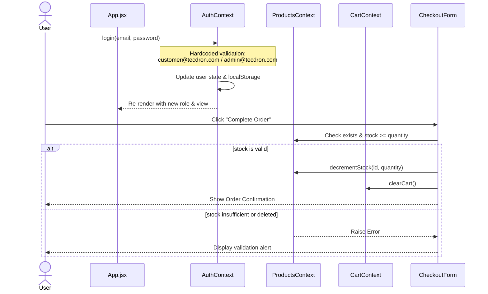

# Design: Authentication & Role-Based Access Control Integration

## Technical Approach
We will implement client-side Authentication and Role-Based Access Control (RBAC) utilizing React Context APIs. State-based view transitions will manage local navigation between catalog, login, checkout, and admin dashboard views.

## Architecture Decisions

| Option | Tradeoff | Decision |
| :--- | :--- | :--- |
| **Routing**: State-based Router vs React Router | React Router adds bundle size/setup complexity; State-based switcher is simpler for local mock navigation. | **State-based switcher** (`currentView` in `AuthContext`) to retain simplicity. |
| **State Persistence**: `localStorage` vs In-Memory | In-memory resets on reload; `localStorage` preserves cart/auth/inventory state across reloads. | **`localStorage` persistence** for `user`, `currentView`, and `products`. |
| **Inventory State**: Global vs Local Context | Cart-context-only limits scope; Products-level context enables synchronization across both Catalog and Admin view. | **`ProductsContext`** as the single source of truth for current products. |

## Data Flow
The sequence diagram below displays authentication, routing, and checkout verification flows:



## Context Interfaces

### 1. `AuthContext`
Exposed via `useAuth()`. Handles session state, role validation, and view switching.

```typescript
interface User {
  email: string;
  role: 'customer' | 'admin';
}

interface AuthContextType {
  user: User | null;
  currentView: 'catalog' | 'checkout' | 'login' | 'admin';
  login: (email: string, password: string) => void; // Throws error on fail
  logout: () => void;
  setView: (view: 'catalog' | 'checkout' | 'login' | 'admin') => void;
}
```

### 2. `ProductsContext`
Exposed via `useProducts()`. Coordinates product catalog metadata and real-time stock levels.

```typescript
interface Product {
  id: number;
  title: string;
  description: string;
  price: number;
  category: string;
  image: string;
  stock: number;
}

interface ProductsContextType {
  products: Product[];
  addProduct: (product: Omit<Product, 'id'>) => void;
  updateProduct: (id: number, updatedFields: Partial<Product>) => void;
  deleteProduct: (id: number) => void;
  decrementStock: (id: number, quantity: number) => void; // Throws error on insufficient stock
}
```

## File Changes

| File | Action | Details |
| :--- | :--- | :--- |
| `src/context/AuthContext.jsx` | **Create** | Implements `AuthProvider`. Restores `user`/`currentView` from `localStorage`. Has hardcoded credential checks. |
| `src/context/ProductsContext.jsx` | **Create** | Implements `ProductsProvider`. Houses mutable product state, syncs to `localStorage` key `products_inventory` (fallback to `mockData`). |
| `src/components/LoginForm.jsx` | **Create** | Form capturing and validating email format/field presence. Submits to `AuthContext.login`. |
| `src/components/AdminDashboard.jsx` | **Create** | Panel visible *only* to admins. Renders product table with edit/delete buttons, plus form to add/edit. |
| `src/App.jsx` | **Modify** | Wraps root in providers. Directs rendering to views: `catalog`, `checkout`, `login`, `admin`. Restricts unauthorized views. |
| `src/components/ProductCatalog.jsx` | **Modify** | Consumes products from `ProductsContext`. Shows "Add to Cart" button unless out of stock. |
| `src/components/CheckoutForm.jsx` | **Modify** | Performs safety verification prior to transaction. Invokes `decrementStock()` and `clearCart()` upon success. |
| `src/App.css` | **Modify** | CSS definitions for dashboard layouts, form styles, warning/error visual states. |

## Threat Matrix

| Threat | Impact | Mitigation |
| :--- | :--- | :--- |
| **Privilege Escalation** (e.g., Guest accesses admin view) | High | App.jsx checks `user?.role === 'admin'` before rendering `<AdminDashboard />`. |
| **LocalStorage Manipulation** (e.g., Modifying role string) | Medium | Handled via frontend checks for mockup. In production, requires server-side JWT verification. |
| **Race Condition / Stale Stock Checkout** | Medium | Prior to order completion, CheckoutForm verifies cart items against dynamic `ProductsContext` values. |

## Testing Strategy
- **Unit**: Verify login credential outcomes, localStorage read/writes, product additions/deletions, and stock decrement logic.
- **Integration**: Verify complete flow: Add item to cart -> Redirect to login -> Log in -> Redirect to checkout -> Successful completion decreases product stock.
