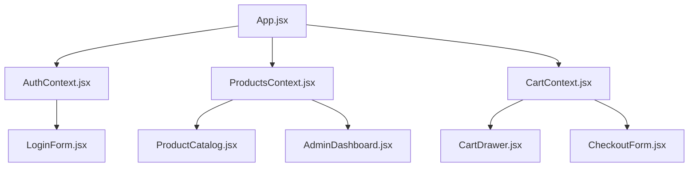

# Proposal: Authentication & Role-Based Access Control Integration

## 1. Intent & Business Value
Integrate client-side Authentication and Role-Based Access Control (RBAC) to support two distinct user personas: **Customers** and **Admins**. 
- **Customers** can browse the product catalog, manage a shopping cart, and perform checkout operations.
- **Admins** have exclusive access to a dedicated dashboard where they can update product catalog details (adding products, modifying metadata) and adjust stock levels.
This changes the application from a static mock-data-driven site into a dynamic single-page application (SPA) with user roles, real-time stock management, and state persistence.

---

## 2. User Stories & Product Rules

### Roles
- **Guest / Unauthenticated User**:
  - Can browse the product catalog.
  - Can add items to the cart.
  - Must log in (or register) to proceed with checkout.
- **Customer**:
  - Can browse the product catalog and manage the cart.
  - Can check out. During checkout, their purchase is validated against real-time stock.
- **Admin**:
  - Upon logging in, redirected immediately to the `AdminDashboard`.
  - Has access *only* to catalog and stock management. Cannot access the shopping cart or customer catalog while in the Admin role.

### Key Business Rules & Workflows (Based on Clarification Round)
1. **Access Level for Guests**: Guests can add products to their cart. If they click "Checkout", they will be redirected to the login form, preserving their cart state. Once logged in as a Customer, they are redirected back to checkout to finish their purchase.
2. **Admin Dashboard Exclusivity**: Admins are routed directly to the dashboard on login. They cannot add items to a cart or view the customer catalog.
3. **Stock Decrementation**: Upon successful checkout, product stock is decremented in `ProductsContext` in real-time.
4. **Cart & Stock Reconciliation**: 
  - Stock updates or product deletions by admins are *not* automatically synced to open carts in real-time.
  - Validation occurs at checkout. If a customer attempts to check out with an item that has insufficient stock or has been deleted, they are alerted, and checkout is blocked until their cart is adjusted.
5. **Session Persistence**: The current authenticated user session (email, role, active view) is persisted in `localStorage`. Page reloads recover the active session and keep the user on their last active view.

---

## 3. Technical Design & Architecture

### State-Based View Switcher (Local Router)
We will continue using the state-based view switching currently in `App.jsx` rather than introducing `react-router-dom`. The view state will support the following views:
- `'catalog'` (default, guest/customer)
- `'checkout'` (requires customer role)
- `'login'` (guest)
- `'admin'` (requires admin role)

View changes will be guarded by client-side authorization rules checked against `AuthContext`.

### Global Context Structure

#### A. `AuthContext.jsx`
- **State**:
  - `user`: `{ email: string, role: 'customer' | 'admin' }` or `null`.
  - `currentView`: the current view code (persisted to localStorage).
- **Functions**:
  - `login(email, password)`: Validates credentials.
    - `admin@tecdron.com` -> Admin role.
    - `customer@tecdron.com` -> Customer role.
    - Invalid inputs throw/return an error.
  - `logout()`: Clears user session, resets view to `'catalog'`, clears relevant persistent states.
- **Persistence**: Save and retrieve `user` and `currentView` from `localStorage` on init.

#### B. `ProductsContext.jsx`
- **State**:
  - `products`: Array of product objects initialized from [mockData.js](file:///home/jmro/Documents/juanfer/src/mockData.js).
- **Functions**:
  - `addProduct(product)`: Adds a new product to the collection.
  - `updateProduct(id, updatedFields)`: Modifies fields (including stock, name, price, description).
  - `deleteProduct(id)`: Removes a product from the collection.
  - `decrementStock(id, quantity)`: Safely subtracts stock. Throws an error if stock is insufficient.

### UI Components

#### A. `LoginForm.jsx`
- Simple form with Email and Password inputs.
- Validates field presence and email structure.
- Displays credentials errors.
- Integrates with `AuthContext.login`.

#### B. `AdminDashboard.jsx`
- Accessible only to logged-in Admins.
- Split layout:
  - **Product List Table**: Shows current stock, price, name. Includes "Edit" and "Delete" actions.
  - **Product Form**: Inline or modal form to edit existing products or add a new product.
- Real-time updates push directly to `ProductsContext`.

#### C. Checkout & Cart Verification updates
- **Checkout Validation**: Before completing the order in `CheckoutForm`, verify that:
  - Every product in the cart still exists in `ProductsContext`.
  - The requested quantity is $\le$ the available stock in `ProductsContext`.
- If validation fails, display a clear error message listing the invalid items and their available stock, preventing the order submission.

---

## 4. Scope Boundaries

### In Scope
- Client-side auth mechanism with two hardcoded logins.
- Dynamic global product inventory state (`ProductsContext`) with stock adjustment capabilities.
- Admin dashboard displaying product catalog management tools.
- Validation checks in `CheckoutForm` against dynamic stock levels.
- Real-time decrementing of product stock on checkout.
- Persistence of user session and view state across page reloads.

### Out of Scope (Non-Goals)
- Backend database integration or actual API calls (all states are local/memory-based or stored in `localStorage`).
- User registration/signup form (only predefined logins are supported).
- Real-time cart inventory synchronization (polling or websocket-like sync of inventory changes while browsing is not required; validation is lazy at checkout time).
- Reset password functionality.

---

## 5. Risk Assessment & Mitigation

| Risk | Impact | Mitigation |
| :--- | :--- | :--- |
| **Session hijacking / Client security** | Low | Client-side security is sufficient for this mockup/prototype. No sensitive data is processed. |
| **Stale stock in Cart** | Medium | Checked at checkout submission. Informative error messages will guide the user to reduce quantity or remove deleted items. |
| **Existing test suite breakage** | High | `App.test.jsx` and `App.integration.test.jsx` will be refactored to wrap components with `AuthProvider` and `ProductsProvider`. |

---

## 6. Next Steps & Implementation Plan
1. **Initialize Contexts**: Create `ProductsContext` and `AuthContext`.
2. **Context Wrapping**: Wrap `App` and root renders in `main.jsx` and test setups.
3. **Build Authentication UI**: Implement `LoginForm` and connect it to view routing.
4. **Build Admin UI**: Implement `AdminDashboard` and add it to state routing.
5. **Connect Catalog to ProductsContext**: Refactor `ProductCatalog` to fetch lists and details from `ProductsContext` rather than static `mockData.js`.
6. **Implement Stock Decrement & Validation**: Update `CheckoutForm` to check stock availability and trigger `decrementStock` on order submission.
7. **Write Tests**: Implement unit and integration tests to verify RBAC flows, validation logic, and session persistence.
